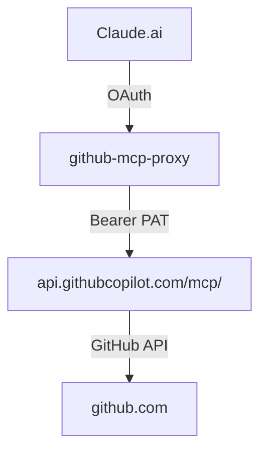

# Documento de Test Complejo — v4.0
> `yessicavs/github-mcp-server` · test para todos los endpoints v4.0
> Actualizado: 2026-04-06 · commit `pendiente`

---

Este documento existe para testear `/github-outline`, `/github-replace-section`, `/github-table-upsert`, `/github-search-dir` y `dry_run`.
Contiene múltiples secciones, tablas con datos repetitivos, bloques de código en varios lenguajes, y YAML frontmatter.

## Estado del sistema

Estado inicial antes de cualquier test de v4.0.
Esta sección será reemplazada completamente por `/github-replace-section`.

- Worker: github-mcp-proxy v3.1 (pre-deploy v4.0)
- Upstream: api.githubcopilot.com/mcp/
- Estado: pendiente de verificación

## Inventario de Workers

| Worker | Versión | Estado | Última actualización |
|---|---|---|---|
| github-mcp-proxy | v3.1 | activo | 2026-04-05 |
| mcp-neo4j-cypher | v2 | activo | 2026-03-28 |
| shared-github-mcp-server-1 | v9 | deprecado | 2026-04-01 |

## Métricas de uso (7 días)

| Servicio | Requests | Errores | P99 (ms) |
|---|---|---|---|
| github-mcp-proxy | 0 | 0 | 0 |
| mcp-neo4j-cypher | 27494 | 244 | 850 |

## Endpoints del Worker

| Endpoint | Versión | Descripción |
|---|---|---|
| POST /github-read | v2.0 | Leer archivo completo |
| POST /github-read-section | v3.1 | Leer sección por líneas |
| POST /github-patch | v2.0 | str_replace |
| POST /github-append | v2.0 | Append al final |
| POST /github-search | v3.0 | Buscar en archivo |

## Arquitectura



## Configuración de referencia

```typescript
// Worker environment bindings
interface Env {
  OAUTH_KV: KVNamespace;  // github-mcp-proxy-OAUTH
  WORKER_URL: string;     // https://github-mcp-proxy.ops-e1a.workers.dev
}
```

```yaml
# wrangler.toml
name = "github-mcp-proxy"
main = "src/index.ts"
compatibility_date = "2024-11-01"
```

```python
# Ejemplo de uso del Worker
import httpx

response = httpx.post(
    "https://github-mcp-proxy.ops-e1a.workers.dev/github-read",
    headers={"Authorization": "Bearer <token>"},
    json={"owner": "yessicavs", "repo": "github-mcp-server", "path": "README.md"}
)
```

## Gaps pendientes

Lista de mejoras identificadas durante la sesión de auditoría del 5 Abr 2026:

1. Activar Logpush en github-mcp-proxy
2. Añadir `read:org` al PAT para osiris-intelligence
3. Logging de tool name en handler /mcp
4. Crear índice de documentación ops completo

## Changelog

- 2026-04-05: github-mcp-proxy v3.1 deployado — /github-read-section añadido
- 2026-04-05: docs/ops/ estructura creada con índice y audit comparativo
- 2026-04-06: documento de test complejo creado para v4.0
